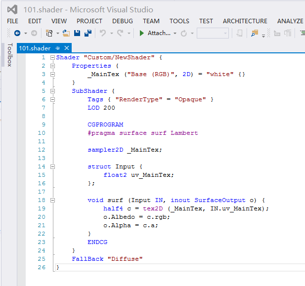
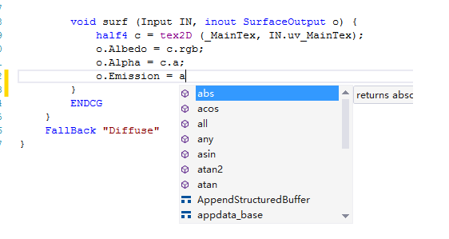
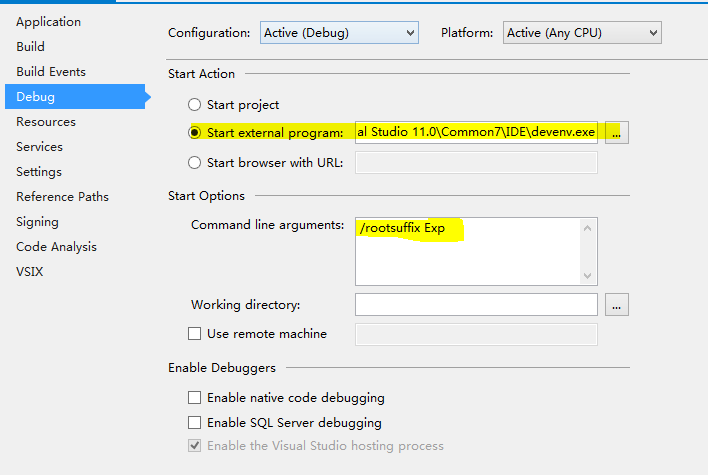

ShaderlabVS
===========

ShaderlabVS is a Visual Studio Plugin for Unity Shaderlab programming. It supports support .shader, .compute, .cginc, .glslinc, .cg and .hlsl files.  Latest releae build can be found at [here](http://blog.shuiguzi.com/2014/10/28/Release/) or the Release page.

 

### Supports files:

* .shader
* .cginc
* .glslinc
* .compute
* .cg
* .hlsl

Features
-----

### Syntax Hightlighting and outlining

### Quickinfo

### Code Completion

### Signature help for CG and Unity built in functions

Development
-----

### Requirements 

* Visual Studio
* Visual Studio SDK

### How to debug in Visual Studio
1. Download and install Visual Studio SDK
2. Open ShaderlabVS solution
3. Press *F6* to build solution
4. If you want to debug it in Visual Studio, and encounter problems, please make sure the **_Start exteral program_** and **_Comand line arguments_** in the **Debug** tab of ShaderlabVS project settings have value as follow:
    1. Set **_Start exteral program_** to the path of devenv.exe (the Visual studio main program)
    2. set **_Comand line arguments_** to **/rootsuffix Exp**. Below is a screenshot for the settings:
    

### Support Visual Studio Versions:
* Visual Studio 2015

__The other version are not tested, not sure if there are also work or not.__

### Thanks To

晨曦

